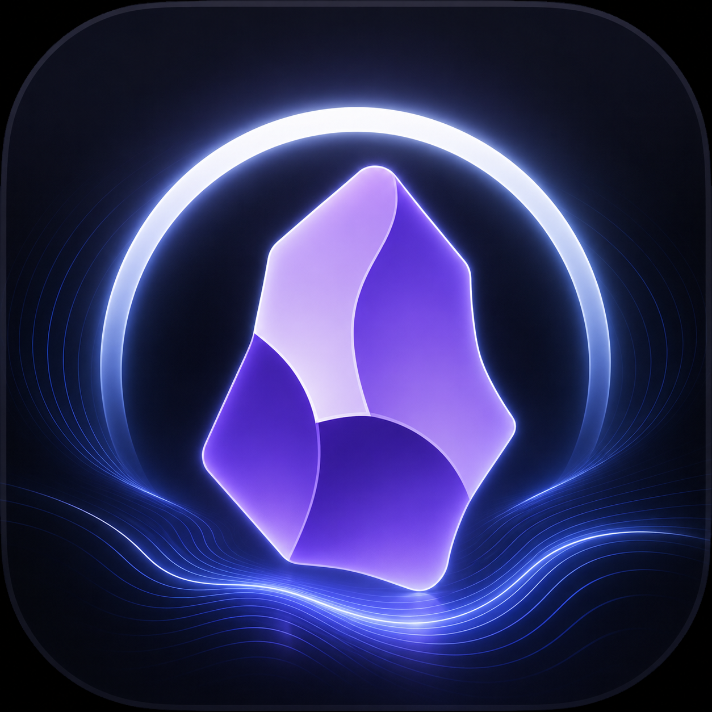

<p align="center">
  
</p>

<h1 align="center">OHsidian</h1>

<p align="center">
  <strong>Obsidian for HarmonyOS</strong>
</p>

<p align="center">
  Run the Obsidian note-taking experience you know and love on HarmonyOS devices — with multi-window support, one-tap Huawei Account sign-in, Huawei Cloud sync, and comprehensive native system integration.
</p>

<p align="center">
  
  
  
  
</p>

---

## Table of Contents

- [Overview](#overview)
- [Architecture](#architecture)
- [Features](#features)
- [Module Structure](#module-structure)
- [Adapter Layer](#adapter-layer)
- [Huawei Cloud Sync](#huawei-cloud-sync)
- [Build & Run](#build--run)
- [Project Structure](#project-structure)
- [Dependencies](#dependencies)
- [License](#license)
- [Acknowledgments](#acknowledgments)

---

## Overview

**OHsidian** is an unofficial port of the Obsidian note-taking application for the HarmonyOS (HongMeng) platform. Rather than reimplementing Obsidian from scratch, it wraps the original Obsidian (`obsidian.asar`) inside a complete Electron compatibility layer running atop the HarmonyOS native runtime.

At its core, OHsidian **shims the Electron API surface using HarmonyOS native capabilities**. A C++ native library (`libadapter.so`), an ArkTS adapter layer, and a JSBind bridge work together to make Obsidian's Node.js/Electron runtime operate seamlessly on HarmonyOS. Meanwhile, deep integration with the Huawei ecosystem — Account Kit, Cloud Foundation Kit, Status Bar extensions — makes the experience feel truly native.

| Project Info | |
|-------------|------|
| App ID | `com.mikannqaq.obsidian` |
| Version | 1.0.0 (versionCode: 1000000) |
| Target SDK | HarmonyOS 6.0.2(22) / API 22 |
| Target Devices | 2in1 (foldable/tablet), Tablet |
| Language | ArkTS (TypeScript) |
| Build System | Hvigor |
| Obsidian Engine | 1.12.7 |

---

## Architecture

```
┌──────────────────────────────────────────────────────┐
│                   Obsidian 1.12.7                     │
│                   (obsidian.asar)                     │
├──────────────────────────────────────────────────────┤
│             Electron API Compatibility                │
│    ┌──────────────┐  ┌──────────────┐                │
│    │  @electron/   │  │   Node.js    │                │
│    │    remote     │  │   Runtime    │                │
│    └──────┬───────┘  └──────┬───────┘                │
├──────────┼──────────────────┼────────────────────────┤
│          │   JSBind Bridge   │                        │
│          ▼                  ▼                        │
│  ┌──────────────────────────────────────┐            │
│  │          C++ libadapter.so            │            │
│  └──────────────────────────────────────┘            │
├──────────────────────────────────────────────────────┤
│            ArkTS Adapter Layer (~50 Adapters)         │
│  CloudSync │ FileSys │ Notify │ IME │ Theme │ ...    │
├──────────────────────────────────────────────────────┤
│              HarmonyOS Native Runtime                 │
│   Ability │ ArkUI │ AccountKit │ CloudFoundation     │
└──────────────────────────────────────────────────────┘
```

**Layer breakdown:**

- **Obsidian Layer** — Stock `obsidian.asar`, unmodified Obsidian 1.12.7 application code
- **Electron Compatibility** — `@electron/remote` provides the remote module API; `main.js` handles asar loading and update management
- **JSBind Bridge** — Connects the JS runtime to the ArkTS native layer, forwarding Electron API calls to the appropriate adapters
- **C++ Native Library** — `libadapter.so` provides core system-level API bindings
- **ArkTS Adapter Layer** — ~50 adapters wrapping HarmonyOS APIs as Electron-compatible interfaces
- **HarmonyOS Foundation** — System-native capabilities: Ability components, ArkUI, Huawei Account, Cloud Storage, etc.

---

## Features

### Core Obsidian Experience

- Full Obsidian 1.12.7 note editing and management
- Complete compatibility with all community plugins and themes
- Local Vault creation, management, and browsing
- Real-time Markdown preview and editing
- Graph view, backlinks, and other advanced features

### Multi-Window Support

- Main windows, sub-windows, embedded windows, floating windows
- Persistent window position and size memory
- Isolated rendering processes (via `ChildProcess`)
- Status bar extension window

### Huawei Ecosystem Integration

- **One-Tap Huawei Account Sign-In** — Seamless authentication via Account Kit's `LoginWithHuaweiIDButton`
- **Huawei Cloud Sync** — Cloud backup and cross-device Vault synchronization via Cloud Foundation Kit
- **Status Bar Extension** — Persistent system status bar presence via `StatusBarViewExtensionAbility`

### Native System Integration

| Category | Adaptations |
|----------|-------------|
| File System | File manager, file picker, native dialogs, trash compatibility layer |
| Input | IME framework, drag-and-drop, multi-touch |
| Display | Multi-monitor management, dark/light theme following, custom cursors |
| Notifications | System push notifications, screen lock event monitoring |
| Device | Battery status, Bluetooth (Classic + BLE), power management, screenshots |
| Security | Certificate management, biometric authentication, clipboard access |
| Other | Print service, text-to-speech, OCR recognition, geolocation, external protocol handling |

### Auto-Update

- Detects `obsidian-{version}.asar` update packages
- RSA-SHA256 signature verification + SHA256 hash verification
- Hot-reloads new version after replacing the asar archive

---

## Module Structure

The project follows the standard HarmonyOS dual-module architecture:

### `web_engine` (HAR Static Library)

The core engine module providing all Electron compatibility functionality and adapters. Can be reused by other HarmonyOS applications.

```typescript
// Public exports (Index.ets)
export { WebAbilityStage } from './src/main/ets/application/AbilityStage'
export { WebAbility } from './src/main/ets/ability/WebAbility'
export { WebEmbeddedAbility } from './src/main/ets/ability/WebEmbeddedAbility'
export { WebWindow, WebSubWindow, WebEmbeddedWindow, WebWindowNode } from './src/main/ets/components/...'
export { WebChildProcess } from './src/main/ets/process/WebChildProcess'
```

**Dependency Injection** — InversifyJS manages ~50 adapters registered as singletons:

```
CommonModule  → AbilityManager, DragParamManager, SystemFloatingWindowManager
AdapterModule → ContextAdapter, DragDropAdapter, MultiInputAdapter,
                NativeThemeAdapter, PermissionManagerAdapter, DialogAdapter,
                TrashAdapter, CloudSyncAdapter ...
```

### `electron` (HAP Entry Package)

The executable application module containing all UI pages and application logic.

**Ability Components:**

| Ability | Page | Purpose |
|---------|------|---------|
| `EntryAbility` | Index.ets | Main entry point, initializes AGC |
| `BrowserAbility` | WindowNode.ets | Browser process window |
| `StatelessAbility` | Index.ets | Stateless windows |
| `BrowserEmbeddedAbility` | EmbeddedWindow.ets | Embedded UI |
| `StatusBarEntryAbility` | StatusBarPage.ets | Status bar extension |

**UI Pages:**

| Page | Description |
|------|-------------|
| `Index.ets` | Main view hosting the `WebWindow` component |
| `WindowNode.ets` | Browser window node |
| `SubWindow.ets` | Sub-window (popups, settings, etc.) |
| `EmbeddedWindow.ets` | Embedded window |
| `Login.ets` | Huawei Account sign-in page |
| `StatusBarPage.ets` | Status bar page |
| `WebPage.ets` | WebView page for privacy agreements, etc. |

---

## Adapter Layer

The adapter layer is the most critical infrastructure in OHsidian — it wraps HarmonyOS native APIs as Electron-compatible interfaces, allowing Obsidian to run on HarmonyOS with zero awareness of the underlying platform.

### Adapter Catalog

Each adapter extends `BaseAdapter`, is registered as a singleton via InversifyJS, and comes with a corresponding JSBind binding class:

```
web_engine/src/main/ets/adapter/
├── Accessibility.ets           # Accessibility features
├── AppLifecycle.ets            # Application lifecycle
├── AppWindow.ets               # Application window operations
├── Battery.ets                 # Battery status
├── Bluetooth.ets               # Bluetooth Classic
├── BluetoothLowEnergy.ets      # Bluetooth Low Energy
├── BrowserPolicy.ets           # Browser security policies
├── CertManager.ets             # Certificate management
├── CloudSync.ets               # Huawei Cloud Sync ⭐
├── Context.ets                 # Application context
├── ContextPath.ets             # File path resolution
├── Cursor.ets                  # Custom cursors
├── Device.ets                  # Device information
├── DeviceInfo.ets              # Hardware information
├── DeviceUserAuth.ets          # Biometric authentication
├── Dialog.ets                  # Native dialogs
├── Display.ets                 # Display/monitor management
├── DragDrop.ets                # Drag-and-drop
├── ElectronApp.ets             # Electron App API shim
├── ExternalProtocol.ets        # External protocol handlers
├── FileManager.ets             # File system operations
├── FilePicker.ets              # File picker
├── Font.ets                    # System font enumeration
├── Geolocation.ets             # Geolocation
├── I18n.ets                    # Internationalization
├── IMF.ets                     # Input Method Framework
├── Media.ets                   # Media playback
├── MimeType.ets                # MIME type mapping
├── MultiInput.ets              # Multi-window input
├── NativeTheme.ets             # System theme (dark/light)
├── NetConnection.ets           # Network connectivity
├── Notification.ets            # System notifications
├── Ocr.ets                     # OCR recognition
├── PasteBoard.ets              # Clipboard
├── PermissionManager.ets       # Permission management
├── PopupWindow.ets             # Popup windows
├── PowerMonitor.ets            # Power monitoring
├── Print.ets                   # Print service
├── Process.ets                 # Process management
├── RunningLock.ets             # Wake locks
├── ScreenlockMonitor.ets       # Screen lock monitoring
├── Screenshot.ets              # Screen capture
├── ShapeDetection.ets          # Shape detection
├── Speech.ets                  # Text-to-speech
├── StatusBar.ets               # Status bar control
├── SubWindow.ets               # Sub-window management
├── SystemFloatingWindow.ets    # System floating windows
└── Trash.ets                   # Trash/recycle bin operations
```

### JSBind Mechanism

Each adapter has a corresponding Bind class that registers its methods with the JS runtime:

```typescript
// Example: CloudSync adapter JSBind registration
JsBindingUtils.bindFunction("CloudSync.uploadFile", cloudSyncAdapter.uploadFile)
JsBindingUtils.bindFunction("CloudSync.downloadFile", cloudSyncAdapter.downloadFile)
JsBindingUtils.bindFunction("CloudSync.listCloudFiles", cloudSyncAdapter.listCloudFiles)
// ...
```

All bindings are activated at startup through `JsBindingMethod.ets`.

---

## Huawei Cloud Sync

OHsidian implements Vault cloud synchronization based on Huawei Cloud Foundation Kit.

### Sync Architecture

```
┌──────────────┐     ┌──────────────────┐     ┌─────────────────────┐
│   Obsidian   │────▶│  CloudSyncAdapter │────▶│ CloudFoundation Kit  │
│   triggers    │     │  (ArkTS Adapter)  │     │  (Huawei Cloud)      │
│   writes     │     │                  │     │                     │
└──────────────┘     └──────────────────┘     └─────────────────────┘
                                                    │
                                              ┌─────▼──────────┐
                                              │  Bucket:        │
                                              │  ohsidian-vault │
                                              │  -sync-75ued    │
                                              └────────────────┘
```

### Storage Structure

```
{userId}/
  └── vaults/
      └── {vaultName}/
          ├── file1.md
          ├── attachments/
          │   └── image.png
          └── ...
```

### Sync Operations

| Operation | Description |
|-----------|-------------|
| `uploadFile` | Upload local file to cloud |
| `downloadFile` | Download file from cloud |
| `listCloudFiles` | List files in cloud |
| `deleteCloudFile` | Delete cloud file |
| `getSyncStatus` | Get sync status |

### Sign-In Flow

1. Obsidian writes a `.hcs-login-pending` marker file
2. The HarmonyOS side detects it via a 3-second polling interval
3. An `hcs-login` dialog appears with a one-tap Huawei Account sign-in button
4. After user authorization, `userId` is persisted to `hcs-user.json` for Obsidian to read
5. All subsequent sync operations build cloud paths based on this `userId`

---

## Build & Run

### Prerequisites

| Tool | Required Version |
|------|-----------------|
| DevEco Studio | 5.0.0+ |
| HarmonyOS SDK | API 22 (6.0.2) |
| Node.js | 18.x+ |
| Hvigor | 5.0.0+ |

### Build Steps

```bash
# 1. Clone the repository
git clone https://github.com/your-username/ohsidian.git
cd ohsidian

# 2. Install dependencies (automatically done in DevEco Studio)
#    Or manually:
hvigorw install

# 3. Build the HAP
hvigorw assembleHap

# 4. Output artifact
# build/outputs/default/electron-default-signed.hap
```

Alternatively, open the project in DevEco Studio and click **Build > Build HAP(s)**.

### Signing Configuration

Configure signing in `build-profile.json5`:

> **Note:** `build-profile.json5` is `.gitignore`-d. Copy `build-profile.example.json5` and fill in your own credentials.

```json5
{
  "app": {
    "signingConfigs": [
      {
        "name": "default",
        "type": "HarmonyOS",
        "material": {
          "certpath": "~/.ohos/config/your_cert.cer",
          "storePassword": "******",
          "keyAlias": "debugKey",
          "keyPassword": "******",
          "profile": "~/.ohos/config/your_profile.p7b",
          "signAlg": "SHA256withECDSA"
        }
      }
    ]
  }
}
```

### Huawei AGC Setup

> **Note:** `agconnect-services.json` is `.gitignore`-d. Copy `agconnect-services.example.json` and fill in your own credentials.

1. Create an app on [AppGallery Connect](https://developer.huawei.com/consumer/en/service/josp/agc/)
2. Download `agconnect-services.json`
3. Place it at `electron/src/main/resources/rawfile/agconnect-services.json`
4. Enable Account Kit and Cloud Storage services

---

## Project Structure

```
obsidian/
├── AppScope/                         # Global app configuration
│   ├── app.json5                     # bundleName, version, multi-instance mode
│   └── resources/base/
│       ├── element/string.json       # App name "OHsidian"
│       ├── media/                    # App icons (startIcon, trayIcon)
│       └── profile/                  # Font scale settings
│
├── web_engine/                       # HAR static library (core engine)
│   ├── Index.ets                     # Public API exports
│   ├── childProcess.ets              # Child process exports
│   ├── oh-package.json5              # Deps: inversify, reflect-metadata
│   ├── hvigorfile.ts                 # harTasks build
│   └── src/main/
│       ├── ets/
│       │   ├── ability/              # WebAbility, WebEmbeddedAbility base classes
│       │   ├── adapter/              # ~50 system adapters
│       │   ├── application/          # AbilityStage
│       │   ├── common/               # DI container, constants, managers
│       │   ├── components/           # WebWindow, WebSubWindow UI components
│       │   ├── interface/            # TypeScript interface definitions
│       │   ├── jsbindings/           # JSBind registration
│       │   ├── process/              # ChildProcess management
│       │   └── utils/                # Logging, helper utilities
│       ├── cpp/types/libadapter/     # C++ native library type declarations
│       └── resources/resfile/resources/app/
│           ├── main.js               # Electron bootstrap entry point
│           ├── package.json          # Obsidian 1.12.7 wrapper config
│           └── obsidian.asar          # Obsidian application archive
│
├── electron/                         # HAP entry module
│   ├── oh-package.json5              # Deps: web_engine, AGC hmcore
│   ├── hvigorfile.ts                 # hapTasks build
│   └── src/main/
│       ├── module.json5              # Module manifest (Abilities, pages, permissions)
│       ├── ets/
│       │   ├── Application/          # MyAbilityStage
│       │   ├── entryability/         # Entry, Browser, Stateless Ability
│       │   ├── extensionAbility/     # EmbeddedAbility, StatusBar
│       │   ├── pages/                # UI pages
│       │   └── process/              # CustomChildProcess
│       ├── resources/
│       │   ├── base/element/         # String resources
│       │   ├── base/profile/         # main_pages routing config
│       │   ├── rawfile/              # agconnect-services.json
│       │   └── zh_CN|en_US/element/  # i18n strings
│       └── ohosTest/                 # Unit tests
│
├── hvigor/                           # Hvigor build configuration
├── hvigorfile.ts                     # Root build file (appTasks)
├── build-profile.example.json5       # Build config template
├── oh-package.json5                  # Root package config
└── oh-package-lock.json5             # Dependency lock file
```

---

## Dependencies

### Runtime Dependencies

| Dependency | Version | Description |
|------------|---------|-------------|
| `inversify` | ^6.0.1 | IoC container for adapter dependency injection |
| `reflect-metadata` | ^0.1.13 | TypeScript decorator metadata |
| `@electron/remote` | ^2.1.3 | Electron remote module compatibility |
| `@hw-agconnect/hmcore` | ^1.0.1 | Huawei AGC core services |
| `libadapter.so` | — | C++ native adapter library (local reference) |
| `btime` | — | File timestamp utilities |
| `get-fonts` | — | System font enumeration |

### Dev Dependencies

| Dependency | Version | Description |
|------------|---------|-------------|
| `@ohos/hypium` | ^1.0.6 | HarmonyOS test framework |
| `@ohos/hvigor-ohos-plugin` | — | Hvigor build plugin |

---

## License

This project is open-sourced under the **BSD 3-Clause License**.

```
Copyright (c) 2023-2025, Haitai FangYuan Co., Ltd.
All rights reserved.
```

### Third-Party Licenses

- **Obsidian** is a trademark of its respective owners. This project provides a HarmonyOS-compatible runtime environment for the pre-compiled `obsidian.asar`.
- **Electron** and `@electron/remote` are under the MIT License.
- **InversifyJS** is under the MIT License.
- **Huawei SDK** components are subject to the Huawei Developer Agreement.

---

## Acknowledgments

This project stands on the shoulders of giants:

- [Obsidian](https://obsidian.md) — The note-taking app that changed knowledge management
- [Electron](https://www.electronjs.org) — The cross-platform desktop application framework
- [HarmonyOS](https://developer.huawei.com/consumer/en/harmonyos/) — The all-scenario distributed operating system
- [InversifyJS](https://inversify.io) — The powerful TypeScript IoC container

---

<p align="center">
  <sub>OHsidian is a community project and is not affiliated with Obsidian officially.</sub>
</p>
